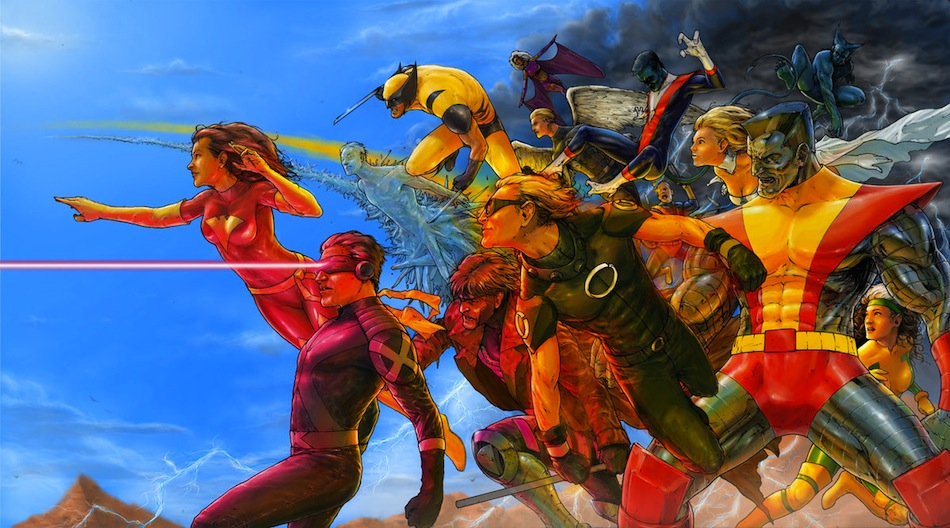

!SLIDE small 
#Enumerable

    @@@ Ruby
    class Xmen
      include Enumerable

      attr_accessor :team

      def initialize(team_members)
        @team = team_members
      end
      
      # must implement each method 
      def each &block
        @team.each{|xman| block.call(xman)}
      end
     
    end

!SLIDE smaller
#Enumerable
    @@@ Ruby
      xmen = Xmen.new ["Wolverine", "Storm", "Rogue", "Gambit"]

      xmen.first #=> Wolverine
      xmen.sort  #=> Gambit, Rogue, Storm, Wolverine

!SLIDE center
# Mixins in the wild

#### http://browse.deviantart.com/?qh=&section=&q=xmen#/d24upst

!SLIDE
# Mongoid

    @@@ Ruby
      class Artist
        include Mongoid::Document
        field :name, type: String
        embeds_many :instruments
      end

!SLIDE small
# Mongoid

    @@@ Ruby
      class River
        include Mongoid::Document
        include Mongoid::Spacial::Document

        field :name, type: String
        field :source, type: Array, spacial: true

        spacial_index :source
      end

!SLIDE small
#CanCan
    
    @@@ Ruby

      class Ability
        include CanCan::Ability

        def initialize(user)
          
          if user.admin?
            can :manage, :all
          else
            can :read, :all
          end
        
        end
      end

!SLIDE center
# Oh no javascript

!SLIDE bullets small
#Oh no javascript
* Angus Croll
* http://javascriptweblog.wordpress.com/2011/05/31/a-fresh-look-at-javascript-mixins/

!SLIDE 
#Oh no javascript
## github/garrensmith/LazyBoy
  
!SLIDE small
# Oh no javascript
    @@@ javascript
      var Flyable = function () {
       
        this.fly_now = function () {
          console.log("I believe I can fly");
        } 
        
      }

!SLIDE small
# Oh no javascript
    @@@ javascript
      var Person = function () {};

      Flyable.call(Person.prototype);

      var average_joe = new Person();

      average_joe.fly_now();
      #=> I believe I can fly
      

