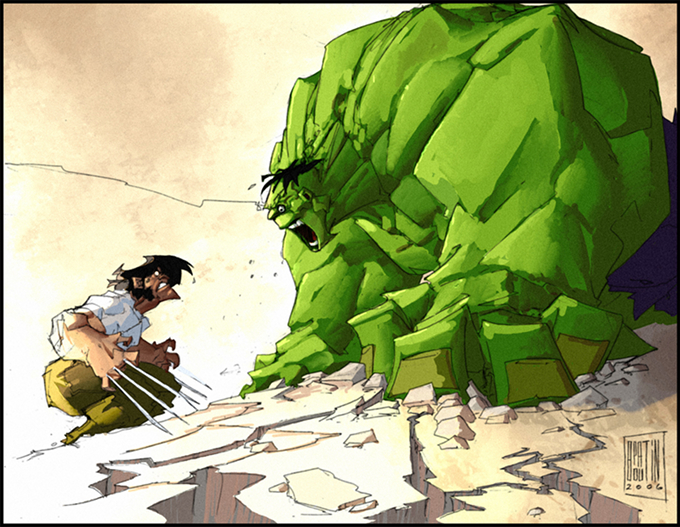

!SLIDE center
#Get super powers with Mixins

!SLIDE center

### www.redcometlabs.com
### @garrensmith
### garren@redcometlabs.com

!SLIDE
# Super Hero Factory

!SLIDE 
# Super Hero Factory

## Create flying ability

!SLIDE 
# Super Hero Factory

## Creating Deadly laser eyes

!SLIDE

# Super Hero Factory

    @@@ Ruby
      class FlyingBase

        def can_fly?
          true
        end

        def fly_to(destination)
          puts "I will fly to #{destination}"
        end

      end

!SLIDE
# Super Hero Factory

    @@@ Ruby
      class SuperCoolFlyingHero < FlyingBase
    
      end

!SLIDE
# Super Hero Factory

    @@@ Ruby
      my_hero =  SuperCoolFlyingHero.new    
      my_hero.fly_to "Belville"

!SLIDE small
# Super Hero Factory
    
    @@@ Ruby
      class DeadlyLaserEyesBase
        def burn_that_mofo( name_of_mofo )
          puts "I shall burn you #{name_of_mofo}"
        end
       
      end

!SLIDE 
#Super Hero Factory

## We need to pivot!
[pic of xavier]

!SLIDE 
#Super Hero Factory

  @@@ Ruby
    class CombinedPowerHero < DeadlyLaserEyes < FlyingBase
    
    end

!SLIDE
# Super Hero Factory

## [Insert new super hero pic]

