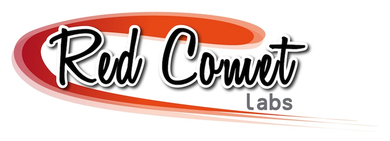

!SLIDE center
#Get super powers with Mixins

!SLIDE center

### www.redcometlabs.com
### @garrensmith
### garren@redcometlabs.com

!SLIDE center
# Super Hero Factory

#### http://andreewallin.deviantart.com/art/Mecha-factory-97454256?q=boost%3Apopular%20factory&qo=4

!SLIDE center
# Create flying ability

!SLIDE center
# Creating Deadly laser eyes

!SLIDE

# Super Hero Factory

    @@@ Ruby
      class FlyingBase

        def can_fly?
          true
        end

        def fly_to(destination)
          puts "I will fly to #{destination}"
        end

      end

!SLIDE
# Super Hero Factory

    @@@ Ruby
      class SuperCoolFlyingHero < FlyingBase
    
      end

!SLIDE
# Super Hero Factory

    @@@ Ruby
      my_hero =  SuperCoolFlyingHero.new    
      my_hero.fly_to "Belville"

!SLIDE small
# Super Hero Factory
    
    @@@ Ruby
      class DeadlyLaserEyesBase

        def burn_that_mofo( name_of_mofo )
          puts "I shall burn you #{name_of_mofo}"
        end
       
      end

!SLIDE center

## We need to pivot!

!SLIDE smaller
#Super Hero Factory

    @@@ Ruby
      class CombinedPowerHero < DeadlyLaserEyes < FlyingBase
      end

!SLIDE center
# Super Hero Factory

